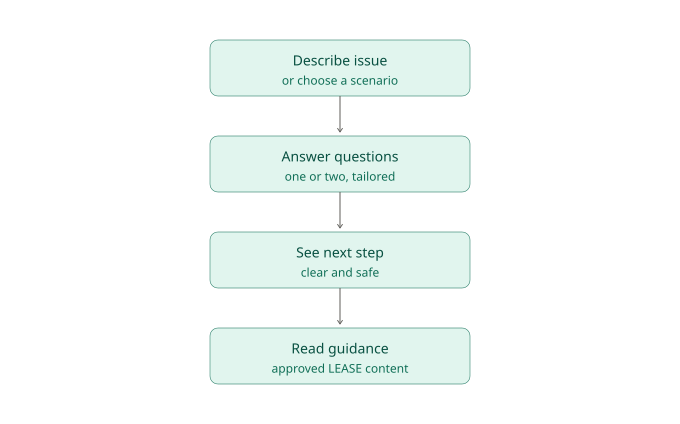
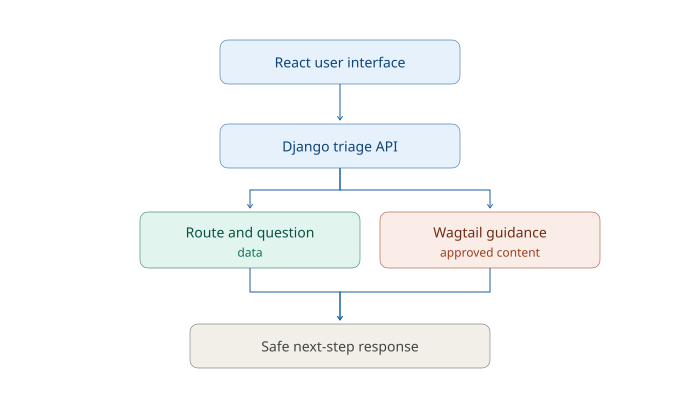

# Leasehold enquiry triage — plan

**Komail Shah · 31 August 2026**

## The problem we are solving

People arrive at LEASE when something about their home feels confusing or urgent. They may not know the legal language for it, and a long list of articles is unlikely to help in that moment.

This first prototype will give a leaseholder a simple way to describe their issue or choose a familiar scenario. It will then guide them through a small number of relevant questions and show one clear next step in plain English.

For the first version, useful means that a person can complete the journey without creating an account, understand what the prototype thinks their broad issue is, and be directed to approved guidance rather than being given legal advice by the application.

## Scope and assumptions

- The prototype will cover three common routes: **service charges**, **lease extensions**, and **repairs**. A person whose issue does not fit one of these routes will see a clear fallback and be invited to choose a scenario instead.
- The triage is a small, deterministic set of rules. It may match simple words in free text, but it will not try to interpret every possible situation.
- The result is signposting, not legal advice. It will use carefully written dummy guidance and make that boundary clear.
- The interface will be built with React and TypeScript. A small Django API will hold the route and outcome data. Wagtail will be introduced only for managing guidance content, reflecting LEASE's production stack without turning the exercise into a CMS project.
- No account, contact form, analytics identifier, or enquiry history will be created. Free text is processed only for the current request and is not saved by the prototype.
- The initial design should work well on a phone, with semantic controls, clear error messages, visible focus, sufficient contrast, and a sensible keyboard journey.

## Ordered work

| # | Ticket | Done means… |
| --- | --- | --- |
| 1 | Set up the project | React/TypeScript and Django can run locally, the README explains how, and the repository has a first plan commit. |
| 2 | Define the triage content | Three scenarios, their questions, outcomes, and fallback copy exist as small dummy data. Each outcome points to a named guidance item. |
| 3 | Build the Django triage endpoint | The API accepts a scenario or short message plus answers, validates the request, and returns a category, next question, or safe outcome. Important rule paths are unit tested. |
| 4 | Create the user journey | A person can choose a scenario or write a short description, answer the follow-up question, and receive the returned next step. Empty input and an unknown issue are handled kindly. |
| 5 | Add guidance content | Wagtail contains a simple guidance page model and the API returns approved dummy summaries. The React app renders the linked guidance clearly. |
| 6 | Make the flow accessible | Labels, fieldsets, errors, focus handling, keyboard operation, responsive layout, and colour contrast are checked and improved. |
| 7 | Connect and test the vertical slice | The frontend calls the real API. Automated tests cover each main category, invalid input, and the fallback route; one browser journey checks the happy path. |
| 8 | Harden and review | Tighten input validation and error handling, make one focused accessibility or privacy improvement, then document the checks, remaining gaps, and a candid self-review. |

Each ticket will be completed and committed before starting the next one. This keeps the Git history easy to follow and makes it clear what changed at each stage.

## Risks and review focus

| Area | Risk | What I will do now | What a reviewer should check |
| --- | --- | --- | --- |
| Advice boundary | The prototype sounds like it is giving legal advice. | Keep outcomes as simple signposting to approved content; use a fallback when unsure. | Wording, disclaimers, and that no generated advice is shown. |
| Accessibility | A stressed user cannot complete the journey with a keyboard or screen reader. | Use native HTML controls, labelled fields, clear errors, focus management, and manual keyboard checks. | Reading order, focus after each step, contrast, and error announcements. |
| Personal data | Free-text entries could contain sensitive information. | Do not persist text, accounts, or contact details; use only dummy content in development. | Request logging, browser storage, and any accidental data retention. |
| Security and robustness | Bad input or a failing API causes a confusing or unsafe result. | Validate inputs on the server, return generic errors, and avoid exposing implementation details. | Validation, error responses, dependencies, and any debug settings. |
| Triage quality | Keyword matching puts someone in the wrong route. | Keep the categories few, ask a confirming question, and provide a clear fallback. | Boundary cases, confidence of the copy, and whether the route is easy to correct. |

## Deliberate exclusions

This is not a complete advice engine. It will not include authentication, real personal data, saved case histories, live legal content, a complex AI agent, deployment infrastructure, or every leasehold topic. Those are valuable later questions, but they would distract from proving the first helpful journey.

## How I will use AI

AI may help me break a well-defined ticket into smaller steps, improve plain-English wording, and suggest test cases. I will decide the scope and architecture myself, check generated code before using it, and verify the application manually and with tests. I will not ask an AI tool to generate the whole submission or to provide legal advice.
